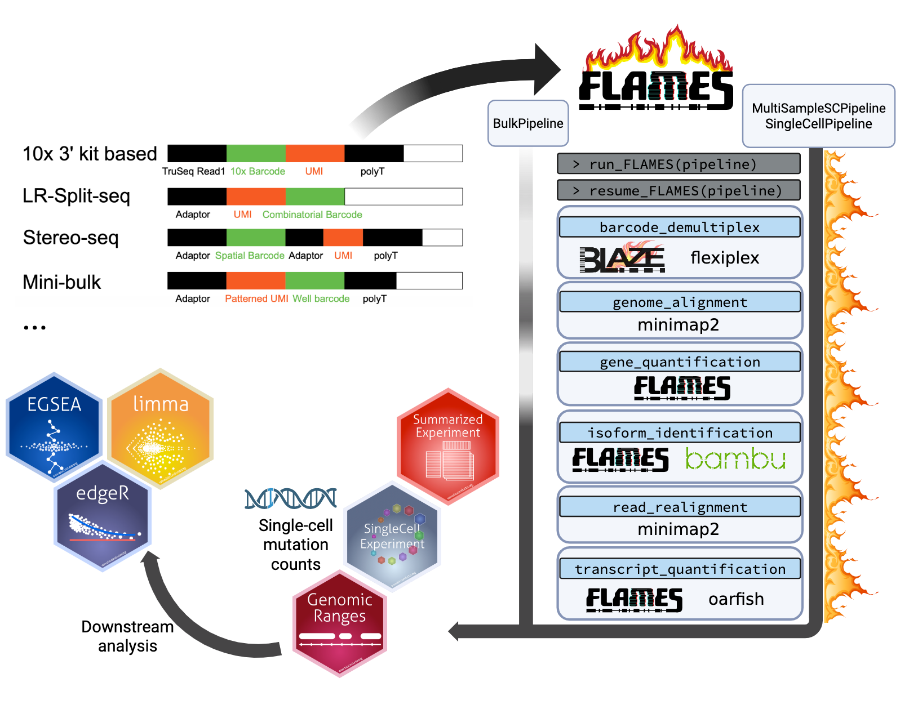

```{r setup, include = FALSE}
knitr::opts_chunk$set(
  collapse = TRUE,
  comment = "#>"
)
library(FLAMES)
```
# FLAMES

The overhauled FLAMES 2.3.1 pipeline provides convenient pipelines for performing single-cell and bulk long-read analysis of mutations and isoforms. The pipeline is designed to take various type of experiments, e.g. with or without known cell barcodes and custome cell barcode designs, to reduce the need of constantly re-inventing the wheel for every new sequencing protocol. 

{width=800px}

## Creating a pipeline

To start your long-read RNA-seq analysis, simply create a pipeline via either `BulkPipeline()`, `SingleCellPipeline()` or `MultiSampleSCPipeline()`. Let's try `SingleCellPipeline()` first:

```{r, eval=TRUE, echo=TRUE}
outdir <- tempfile()
dir.create(outdir)
# some example data
# known cell barcodes, e.g. from coupled short-read sequencing
bc_allow <- file.path(outdir, "bc_allow.tsv")
R.utils::gunzip(
  filename = system.file("extdata", "bc_allow.tsv.gz", package = "FLAMES"),
  destname = bc_allow, remove = FALSE
)
# reference genome
genome_fa <- file.path(outdir, "rps24.fa")
R.utils::gunzip(
  filename = system.file("extdata", "rps24.fa.gz", package = "FLAMES"),
  destname = genome_fa, remove = FALSE
)

pipeline <- SingleCellPipeline(
  # use the default configs
  config_file = create_config(outdir),
  outdir = outdir,
  # the input fastq file
  fastq = system.file("extdata", "fastq", "musc_rps24.fastq.gz", package = "FLAMES"),
  # reference annotation file
  annotation = system.file("extdata", "rps24.gtf.gz", package = "FLAMES"),
  genome_fa = genome_fa,
  barcodes_file = bc_allow
)
pipeline
```

## Running the pipeline

To execute the pipeline, simply call `run_FLAMES(pipeline)`. This will run through all the steps in the pipeline, returning a updated pipeline object:

```{r, eval=TRUE, echo=TRUE}
pipeline <- run_FLAMES(pipeline)
pipeline
```

If you run into any error, `run_FLAMES()` will stop and return the pipeline object with the error message. After resolving the error, you can run `resume_FLAMES(pipeline)` to continue the pipeline from the last step. There is also `run_step(pipeline, step_name)` to run a specific step in the pipeline. Let's show this by deliberately causing an error via deleting the input files:

```{r, eval=TRUE, echo=TRUE}
# set up a new pipeline
outdir2 <- tempfile()
pipeline2 <- SingleCellPipeline(
  config_file = create_config(outdir),
  outdir = outdir2,
  fastq = system.file("extdata", "fastq", "musc_rps24.fastq.gz", package = "FLAMES"),
  annotation = system.file("extdata", "rps24.gtf.gz", package = "FLAMES"),
  genome_fa = genome_fa,
  barcodes_file = bc_allow
)

# delete the reference genome
unlink(genome_fa)
pipeline2 <- run_FLAMES(pipeline2)
pipeline2
```

Let's then fix the error by re-creating the reference genome file and resume the pipeline:

```{r, eval=TRUE, echo=TRUE}
R.utils::gunzip(
  filename = system.file("extdata", "rps24.fa.gz", package = "FLAMES"),
  destname = genome_fa, remove = FALSE
)
pipeline2 <- resume_FLAMES(pipeline2)
pipeline2
```
After completing the pipeline, a `SingleCellExperiment` object is created (or `SummarizedExperiment` for bulk pipeline and list of `SingleCellExperiment` for multi-sample pipeline). You can access the results via `experiment(pipeline)`:

```{r, eval=TRUE, echo=TRUE}
experiment(pipeline)
```

### HPC support

Individual steps can be submitted as HPC jobs via `crew` and `crew.cluster` packages, simply supply a list of crew controllers (named by step name) to the `controllers` argument of the pipeline constructors. For example, we could run the alignment steps through controllers, while keeping the rest in the main R session.
```{r, eval=TRUE, echo=TRUE}
# example_pipeline provides an example pipeline for each of the three types
# of pipelines: BulkPipeline, SingleCellPipeline and MultiSampleSCPipeline
mspipeline <- example_pipeline("MultiSampleSCPipeline")
# Providing a single controller will run all steps in it:
controllers(mspipeline) <- crew::crew_controller_local()
# Setting controllers to an empty list will run all steps in the main R session:
controllers(mspipeline) <- list()
# Alternatively, we can run only the alignment steps in the crew controller:
controllers(mspipeline)[["genome_alignment"]] <- crew::crew_controller_local(workers = 4)
# Or `controllers(mspipeline) <- list(genome_alignment = crew::crew_cluster())`
# to remove controllers for all other steps.
# Replace `crew_controller_local()` with `crew.cluster::crew_controller_slurm()` or other
# crew controllers according to your HPC job scheduler.
```
`run_FLAMES()` will then submit the alignment step to the crew controller. By default, `run_step()` will ignore the crew controllers and run the step in the main R session, since it is easier to debug. You can use `run_step(pipeline, step_name, disable_controller = FALSE)` to prevent this behavior and run the step in crew controllers if available.

You can tailor the resources for each step by specifying different arguments to the controllers. The alignment step typically benifits from more cores (e.g. 64 cores and 20GB memory), whereas other steps might not need as much cores but more memory hungry.

```{r, eval=FALSE, echo=TRUE}
# An example helper function to create a Slurm controller with specific resources
create_slurm_controller <- function(
    cpus, memory_gb, workers = 10, seconds_idle = 10,
    script_lines = "module load R/flexiblas/4.5.0") {
  name <- sprintf("slurm_%dc%dg", cpus, memory_gb)
  crew.cluster::crew_controller_slurm(
    name = name,
    workers = workers,
    seconds_idle = seconds_idle,
    retry_tasks = FALSE,
    options_cluster = crew.cluster::crew_options_slurm(
      script_lines = script_lines,
      memory_gigabytes_required = memory_gb,
      cpus_per_task = cpus,
      log_output = file.path("logs", "crew_log_%A.txt"),
      log_error = file.path("logs", "crew_log_%A.txt")
    )
  )
}
controllers(mspipeline)[["genome_alignment"]] <-
  create_slurm_controller(cpus = 64, memory_gb = 20)
```

See also the [`crew.cluster` website](https://wlandau.github.io/crew.cluster/reference/index.html) for more information on the supported job schedulers.

## Visualizations

### QC plots

Quality metrics are collected throughout the pipeline, and FLAMES provide visiualization functions to plot the metrics. For the first demultiplexing step, we can use the `plot_demultiplex` function to see how well many reads are retained after demultiplexing:

```{r, eval=TRUE, echo=TRUE}
# don't have to run the entire pipeline for this
# let's just run the demultiplexing step
mspipeline <- run_step(mspipeline, "barcode_demultiplex")
plot_demultiplex(mspipeline)
```

### Work in progress

More examples coming soon.


## FLAMES on Windows
Due to FLAMES requiring minimap2 and pysam, FLAMES is currently unavaliable on Windows.

## Citation
Please cite the flames's paper [@flames] if you use flames in your research. As FLAMES used incorporates BLAZE [@blaze], flexiplex [@flexiplex] and minimap2 [@minimap2], samtools, bambu [@bambu]. Please make sure to cite when using these tools.

# Session Info
``` {r echo=FALSE}
utils::sessionInfo()
```

# References
